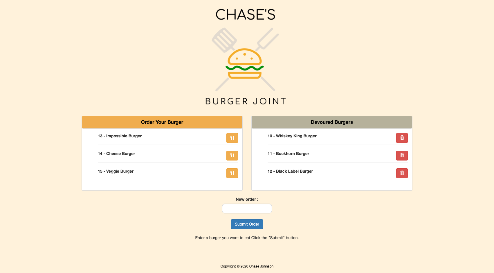

# burger
A burger logger that uses MySQL, Node, Express, Handlebars, and a homemade ORM. 


   

  ## Table of Contents
  - [Description](#description)
  - [Installation](#install)
  - [Usage](#usage)
  - [Licences](#licences)
  - [Questions](#questions)
    
  ## Description
 A restaurant app that lets users input the names of burgers they'd like to eat.

  ## Install
  ```
  npm init
  npm install express
  npm install mysql
  ```
 
  ## Usage
* This application needs mysql to run 
* Open gitbash on Windows or Terminal on Mac
* https://github.com/chaseyb/burger.git
* Open README-Generator in Terminal/CLI, and enter:
```
node server.js
```
  ## Licences 
  

  ## Heroku Link 
  Coming soon 
            
  ## Questions?
  * [Chaseyb](https://github.com/Chaseyb)
  * <chase.b.johnson@gmail.com>

  
